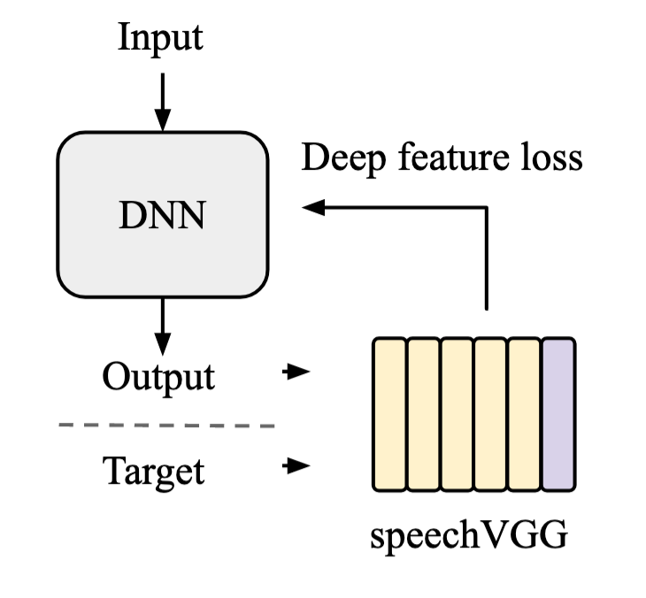

# SpeechVGG: A deep feature extractor for speech processing

For some context... Here, we present code underlying SpeechVGG (sVGG) a simple, yet efficient feature extractor for training deep learning frameworks for speech processing through deep feature losses. In [(Kegler et al., 2019)](https://arxiv.org/pdf/1910.09058.pdf) we firstly applied sVGG to improve the performance of the network for recovering missing parts of speech spectrograms (i.e. speech inpainting). In the follow up paper [(Beckmann et al., 2019)](https://arxiv.org/pdf/1910.09909.pdf) we present a systematic analysis of the influence of the sVGG parameters on the main framework.

To summarize quickly we showed how training a VGG inspired speech to word classifier could be used to extract higher level feature losses.

<p align="center">

</p>

The trained network can then be used to train another network on another task, using the information learned in the classifiction task.

<p align="center">

</p>

Now we are going to walk you through how to use it!

## Train your own...

### Requirements

#### Packages :

* Python 3.6.8
* numpy 1.16.4
* h5py 2.8.0
* SoundFile 0.10.2
* SciPy 1.2.1
* Tensorflow 1.13.1
* Keras 2.2.4

#### Data :

You should create a folder 'LibriSpeech' with the following folders :

    LibriSpeech
    	|_ word_labels
    	|_ split
            |____ test-clean
            |____ test-other
            |____ dev-clean
            |____ dev-other
            |____ train-clean-100
            |____ train-clean-360
            |____ train-other-500


The `word_label` folder should contain the aligned labels, this folder can be downloaded [here](https://imperialcollegelondon.app.box.com/s/yd541e9qsmctknaj6ggj5k2cnb4mabkc).

The `split` folder should contain the extracted Librispeech datasets that can be downloaded [here](http://www.openslr.org/12/).

### Generate dataset

First, preprocess the data (here, [LibriSpeech](http://www.openslr.org/12/) for example):

```bash
python preprocess.py --data ~/LibriSpeech --dest_path ~/LibriSpeechWords
```

Then, obtain the mean and standard deviation of the desired dataset (for normalization):

```bash
python compute_dataset_props.py --data ~/LibriSpeechWords/train-clean-100/ --output_folder data
```

Parameters will be saved as `dataset_props_log.h5` file. Here we attach a version obtained from training part of LibriSpeech data.

### Train

Now you can train the model using the training script:

```bash
python train.py --train ~/LibriSpeechWords/train-clean-100/ --test ~/LibriSpeechWords/test-clean/ --weight_path data --classes 1000 --augment yes 
```

Finally the weights of the model will be saved in the desired direction, here 'data'. Subsequently you can use the trained model, for example, to obtain deep feature losses (as we did in [Kegler et al., 2019](https://arxiv.org/pdf/1910.09058.pdf) & [Beckmann et al., 2019](https://arxiv.org/pdf/1910.09909.pdf)).

## or ...use our pre-trained models!

Available [here](https://imperialcollegelondon.app.box.com/s/hus5093xaq3errmrxnly0zwsubjlo9d8), for all the configurations considered in [(Beckmann et al., 2019)](https://arxiv.org/pdf/1910.09909.pdf).

## check out our examples!

In the examples folder we show you how to use a pre-trained speechVGG model to other tasks.

## Links:

Original papers:
1. [Kegler, Mikolaj, Pierre Beckmann, and Milos Cernak. "Deep speech inpainting of time-frequency masks." arXiv preprint arXiv:1910.09058 (2019)](https://arxiv.org/pdf/1910.09058.pdf)
2. [Beckmann, Pierre, Mikolaj Kegler, Hugues Saltini, and Milos Cernak. "Speech-VGG: A deep feature extractor for speech processing." arXiv preprint arXiv:1910.09909 (2019)](https://arxiv.org/pdf/1910.09909.pdf)
