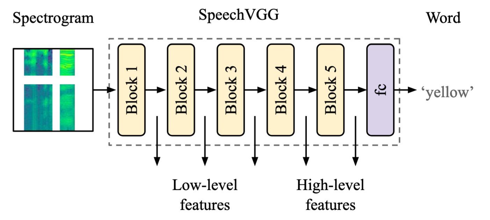
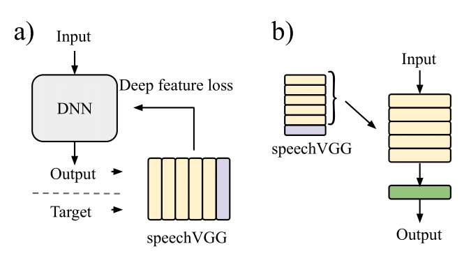

# SpeechVGG: A deep feature extractor for speech processing

[speechVGG](https://arxiv.org/pdf/1910.09909.pdf) is a deep speech feature extractor, tailored specifically for applications in representation and transfer learning in speech processing problems. The extractor adopts the classic [VGG-16](https://arxiv.org/pdf/1409.1556.pdf) architecture and is trained via the word recognition task. 

<p align="center">

</p>

We showed that extractor can capture generalized speech-specific features in a hierarchical fashion. Importantly, the generalized representation of speech captured by the pre-trained model is transferable over distinct speech processing tasks, employing a different dataset. 

<p align="center">

</p>

In our experiments, we showed that even relatively simple applications of the pre-trained speechVGG were capable of achieving results comparable to the state-of-the-art, presumably thanks to the knowledge transfer. For more details and full evaluation, see the original paper.

Here, we present our Python implementation of speechVGG, as introduced in [(Beckmann et al., 2019)](https://arxiv.org/pdf/1910.09909.pdf) and employed for *Deep Speech Inpainting* in [(Kegler et al., 2019)](https://arxiv.org/pdf/1910.09058.pdf) (see the demo [here](https://mkegler.github.io/SpeechInpainting/)). Now we are going to walk you through how to use it!

#### Technical requirements:

**Third party packages**

* Python 3.6.8
* numpy 1.16.4
* h5py 2.8.0
* SoundFile 0.10.2
* SciPy 1.2.1
* Tensorflow 1.13.1
* Keras 2.2.4
* Keras-tqdm 2.0.1

Tested on Linux Ubuntu 18.04 LTS.

## Use our pre-trained models and explore their example applications...

Pre-trained models are available [here](https://imperialcollegelondon.app.box.com/s/hus5093xaq3errmrxnly0zwsubjlo9d8) (all configurations considered in [(Beckmann et al., 2019)](https://arxiv.org/pdf/1910.09909.pdf)). In the [examples folder](https://github.com/bepierre/SpeechVGG/tree/master/examples) of this repository we show you how to apply a pre-trained speechVGG in speaker recognition and speech/music/noise classification, as introduced in [(Beckmann et al., 2019)](https://arxiv.org/pdf/1910.09909.pdf).

## ... or train your own!

Here, we are going to show you how to used the code to train the model from scratch using [LibriSpeech dataset](http://www.openslr.org/12/).

#### Data

You should create a folder 'LibriSpeech' with the following folders :

    LibriSpeech
    	|_ word_labels
    	|_ split
            |____ test-clean
            |____ test-other
            |____ dev-clean
            |____ dev-other
            |____ train-clean-100
            |____ train-clean-360
            |____ train-other-500


The `word_label` folder should contain the aligned labels, this folder can be downloaded [here](https://imperialcollegelondon.app.box.com/s/yd541e9qsmctknaj6ggj5k2cnb4mabkc).

The `split` folder should contain the extracted Librispeech datasets that can be downloaded [here](http://www.openslr.org/12/).

### Generate dataset

First, preprocess the data (here, [LibriSpeech](http://www.openslr.org/12/) for example):

```bash
python preprocess.py --data ~/LibriSpeech --dest_path ~/LibriSpeechWords
```

Then, obtain the mean and standard deviation of the desired dataset (for normalization):

```bash
python compute_dataset_props.py --data ~/LibriSpeechWords/train-clean-100/ --output_folder data
```

Parameters will be saved as `dataset_props_log.h5` file. Here we attach a version obtained from training part of LibriSpeech data.

### Train

Now you can train the model using the training script:

```bash
python train.py --train ~/LibriSpeechWords/train-clean-100/ --test ~/LibriSpeechWords/test-clean/ --weight_path data --classes 1000 --augment yes 
```

Finally the weights of the model will be saved in the desired direction, here 'data'. Subsequently you can use the trained model, for example, to obtain deep feature losses (as we did in [Kegler et al., 2019](https://arxiv.org/pdf/1910.09058.pdf) & [Beckmann et al., 2019](https://arxiv.org/pdf/1910.09909.pdf)).

## References

1. [Beckmann, P.\*, Kegler, M.\*, Saltini, H., and Cernak, M. (2019) Speech-VGG: A deep feature extractor for speech processing. arXiv preprint arXiv:1910.09909.](https://arxiv.org/pdf/1910.09909.pdf)
2. [Kegler, M.\*, Beckmann, P.\*, and Cernak, M. (2020) Deep Speech Inpainting of Time-Frequency Masks. Proc. Interspeech 2020, 3276-3280, DOI: 10.21437/Interspeech.2020-1532.](https://isca-speech.org/archive/Interspeech_2020/pdfs/1532.pdf) + [Demo](https://mkegler.github.io/SpeechInpainting/)
